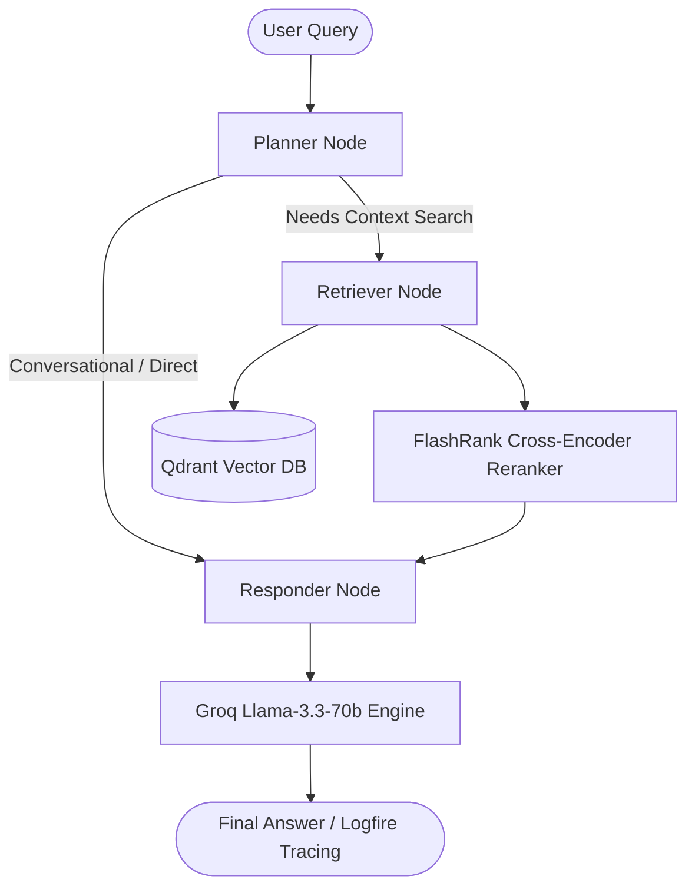

# Enterprise Agentic RAG Pipeline

An enterprise-grade, agentic Retrieval-Augmented Generation (RAG) system built with **FastAPI**, **LangGraph**, **Gemini Embeddings**, **Groq (Llama 3.3 70B)**, **Qdrant Vector Database**, **FlashRank Reranker**, and **Logfire Observability**.

---

## 🏗 System Architecture & Workflow

---

## ✨ Features

- **Agentic Workflow (LangGraph)**: Multi-step execution graph supporting planning, state-aware routing, retrieval, and response synthesis.
- **Multi-Format Ingestion**: Supports parsing for **PDF**, **HTML**, **TXT**, **DOCX**, and **PPTX** documents.
- **Dense Vector Search**: Powered by Google Gemini Embeddings (`text-embedding-004`) stored inside **Qdrant Cloud/Local**.
- **Two-Stage Retrieval & Reranking**: Ultra-fast vector retrieval followed by cross-encoder re-ranking using **FlashRank**.
- **LLM Gateway Integration**: Unified routing with fallback handling powered by **Portkey** and **Groq (Llama 3.3 70B)**.
- **Production Observability & Guardrails**: Full execution tracing via **Pydantic Logfire** & input/output validation via **NVIDIA NeMo Guardrails**.

---
